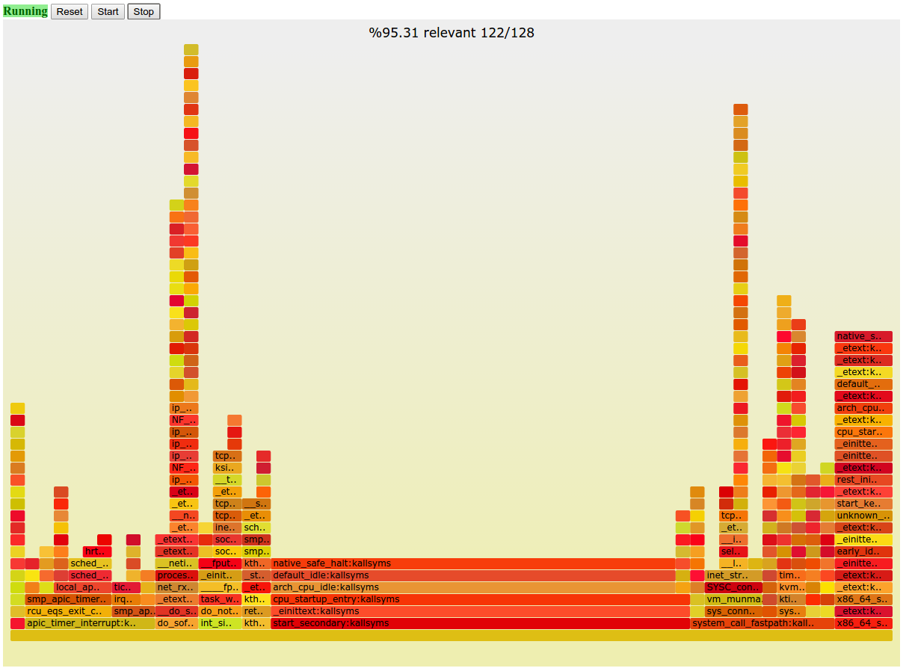

# Guest stack kernel moduel

`gueststack` is a way to sample kernel stack
from a 64 bit Linux guest.

It is currently just a draft, presented mainly to brainstorm ideas of how to sample
guest from the host machine. Things might break. Use with caution.

A known current limitation is, it does not currently differentiate between KVM guests.

Note that this is draft code. Although generally speaking all entry points to the
module should be only accessible by root, it is possible to contain security
vulnerabilities. Use with caution.

## Quick Introduction

Make sure you have Go distribution installed.

    $ ./make.sh
    $ sudo ./gueststack -ssh "sudo -u $USER ssh guest_ip"
    2015/03/12 09:57:54 Fetching kallsyms from guest via SSH
    2015/03/12 09:57:55 Fetched 32904 symbols from kallsyms
    2015/03/12 09:57:55 Compiling the gueststack kernel module, and insmod'ing it
    2015/03/12 09:57:55 Interacting with /debug/gueststack
    2015/03/12 09:57:55 Extracting flamegraph.pl
    2015/03/12 09:57:55 Open your browser on elazar:8080

Browse to http://elazar:8080 and see a small web UI. Start and stop sampling
and see the result as a flame chart.

## Architecture

### Kernel module

The kernel gets as an input relevant address ranges for guest kernel's text.
These should be written to debugfs `/gueststack/relevant_addr`. Debugfs is
usually mounted on `/sys/kernel/debug`.

The kernel module would register a new NMI handler, that would ask the current KVM
guest its current RSP.

It would traverse the first page of the stack, and would record relevant addresses
to a per CPU buffer.

The buffer is available to users at debugfs `/gueststack/stack<#CPU>`.

#### Cavaets

KVM access the current running `kvm_vcpu`, by setting an unexported per CPU variable
`current_vcpu` before and after VM exit.

To access this variable we parse the X86-64 code of an exported function which is
known to use it. We would search for an instruction of type
`mov %gs:DISPLACEMENT32, %reg`, which is highly likely to appear in optimized code
that access per CPU variable.

Once we find this instruction, we would record the offset, and use it to access
`current_vcpu` from out module.

On module load, we would verify that we have the correct offset by setting a sentinel
value to `current_vcpu` (a setter is exported), and verifying we indeed get this value.

Note that this is theoretically dangerous, as a PMI might occur exactly after we set a sentinel value
to `current_vcpu`. This should be very rare, since NMI hardly occurs in a live system,
even when they do, it hardly makes sense to have more than 1 NMI per millisecond,
and the time the system is vulnerable is probably a few cycles only.

### Web UI

The web UI would receive an ELF file, or a `/proc/kallsyms` file. It would find
out the relevant addresses range from it (the first and last text symbol).

Once `/flamegraph` is requested, it would use Brandan Gregg's `flamegraph.pl`
tool to generate a flame chart.

In order to start and stop sampling, the UI would trigger `NMI` interrupts
using the `perf_event_open` system call. It is using the `perf2` utility
to do access the `perf_event_open` system call with JSON.

## TODO

- Once a good way to sample guest OS stack is found, I'd like to integrate it with
the `kvm` kernel module, which is currently unable to record kernel stack.
- Use Chrome's Javascript flame chart library. Do processing on the client, and hence
allow easy way to filter things (e.g., show stacks of a specific VCPU).

## Thanks

Brendan Gregg, for the flamegraph.pl script.
Linux-il mailing list for discussing the problem.

